# Coprocessor Helm Chart

<p align="center">
  
</p>

<p align="center">
  <a href="#quick-start">
    
  </a>
  <a href="https://github.com/rtbot-dev/coprocessor-helm-chart">
    
  </a>
  <a href="#sql-packaging-guidance">
    
  </a>
  <a href="#demo-install-path">
    
  </a>
</p>

Extend the analytical capabilities of your existing ThingsBoard deployment in minutes. The `coprocessor` chart adds a ready-to-run RtBot-powered processing layer that can ingest telemetry, execute SQL-defined signals, and write derived data back into your platform.

Start with the default demo to see the full loop immediately, then disable it and bring your own SQL when you are ready for a more professional deployment shape.

This repository is the public release surface for the coprocessor Helm chart and the public `rtbot-redis` image.

## Why install it

Use this chart when you want to:

- run RtBot SQL against ThingsBoard telemetry in Kubernetes
- register SQL files as part of the deployment instead of managing ad-hoc runtime commands
- publish materialized-view results back into ThingsBoard
- start with a simple same-namespace install and grow into production overrides later

## Quick start

If you already have ThingsBoard running in the same namespace as a Service named `thingsboard`, the fastest path is the built-in demo:

```bash
helm install coprocessor oci://ghcr.io/rtbot-dev/helm-charts/coprocessor \
  --version 0.1.1 \
  --set demo.admin.username=tenant@thingsboard.org \
  --set demo.admin.password=tenant
```

These are now the chart defaults for the demo path and are meant for fresh/local ThingsBoard installs. Override them in any environment where those credentials have already been changed.

What this command is doing:

- installing the `coprocessor` chart next to your existing ThingsBoard service
- enabling the chart's default demo publisher and demo SQL bundle
- logging into ThingsBoard with admin credentials, creating or reusing the demo device, and fetching its token
- registering that token so derived demo telemetry can flow back into ThingsBoard

If you already created a demo device yourself, replace the admin credentials with `--set demo.device.token=<device-access-token>`. If your ThingsBoard credentials are not the fresh/local defaults, override them explicitly. If you are done with the walkthrough and want your own SQL instead, disable the demo with `--set demo.enabled=false`. See [Simple and advanced SQL file input](#simple-and-advanced-sql-file-input).

## How to tell it worked

Run:

```bash
kubectl get pods,jobs
```

You should see:

- a `coprocessor` StatefulSet pod
- a SQL bootstrap Job
- a demo bootstrap Job and demo publisher Deployment when `demo.enabled=true`

If those do not appear or do not become ready, continue with `tests/README.md` and the troubleshooting guidance in this repo.

## Table of contents

- [What the chart installs](#what-the-chart-installs)
- [Prerequisites](#prerequisites)
- [OCI distribution](#oci-distribution)
- [Minimum install](#minimum-install)
- [Demo install path](#demo-install-path)
- [Install smoke testing](#install-smoke-testing)
- [Production configuration guidance](#production-configuration-guidance)
- [SQL packaging guidance](#sql-packaging-guidance)
- [Ingress and egress guidance](#ingress-and-egress-guidance)
- [Values guide](#values-guide)

## What the chart installs

- one `StatefulSet`
- one SQL bootstrap `Job` that waits for the first `rtbot-redis` pod and loads packaged SQL into it
- one demo bootstrap `Job` that either auto-creates the demo device from ThingsBoard admin credentials or uses a supplied token
- one `rtbot-redis` container for RtBot execution and state
- one stream-processing container for ingress and optional egress wiring
- one demo publisher `Deployment` that continuously emits heartbeat and temperature telemetry when demo mode is enabled
- one headless `Service` for the StatefulSet and one client-facing ingress `Service`
- generated `ConfigMap` objects for SQL and Connect config unless you point at existing ones
- an optional generated `Secret`
- a persistent volume claim by default

## Prerequisites

- Kubernetes cluster with Helm 3
- an existing ThingsBoard deployment that is reachable from this namespace
- a StorageClass if `persistence.enabled=true`
- an `rtbot-redis` image pull path that is valid for your environment; the chart default is `ghcr.io/rtbot-dev/rtbot-redis`
- RtBot SQL files for the non-demo path, either inline or in an existing ConfigMap

## OCI distribution

The chart is published as an OCI artifact to GHCR.

Pull a released chart locally:

```bash
helm pull oci://ghcr.io/rtbot-dev/helm-charts/coprocessor \
  --version 0.1.1
```

Install directly from GHCR:

```bash
helm install coprocessor oci://ghcr.io/rtbot-dev/helm-charts/coprocessor \
  --version 0.1.1 \
  --set demo.admin.username=tenant@thingsboard.org \
  --set demo.admin.password=tenant
```

## Minimum install

The base chart assumes the common in-cluster setup: you already have ThingsBoard running in the same namespace, exposed as `http://thingsboard:8080`.

If that matches your cluster, the smallest install from the repository root is the demo-first path:

```bash
helm install coprocessor . \
  --set demo.admin.username=tenant@thingsboard.org \
  --set demo.admin.password=tenant
```

Before installing, confirm the service name resolves the way the chart expects:

```bash
kubectl get svc thingsboard
```

If your ThingsBoard service has a different name, lives in another namespace, or is outside the cluster, override `thingsboard.baseUrl` for that environment.

That install renders:

- the default ingress listener at `/ingest/{stream_name}`
- the default ThingsBoard target at `http://thingsboard:8080`
- the default demo SQL bundle with alive, moving-average, delta/trend, and anomaly-style signals
- a demo publisher that continuously emits telemetry into `demo_sensors`
- demo egress for `rtbot:mv:demo_signals`
- persistent RtBot state in an `8Gi` PVC
- a post-install/post-upgrade SQL bootstrap Job
- a post-install/post-upgrade demo bootstrap Job
- no generated secret unless `secret.create=true`

For a pre-provisioned demo device, use:

```bash
helm install coprocessor . \
  --set demo.device.token=<device-access-token>
```

For professional use after the walkthrough, disable the demo and provide your own SQL package:

```bash
helm install coprocessor . \
  --set demo.enabled=false \
  --set-file sql.files.01-bootstrap\.sql=./sql/01-bootstrap.sql
```

## Demo install path

`values-demo.yaml` is the low-friction walkthrough profile. It keeps the same-namespace ThingsBoard default from the base chart, keeps demo mode enabled, and disables persistence so clusters without a default StorageClass still work.

```bash
helm install coprocessor-demo . \
  -f values-demo.yaml
```

Use the demo profile when you want a fast walkthrough. By default it assumes a fresh/local ThingsBoard install with `tenant@thingsboard.org` / `tenant`. Fill either `demo.admin.*` to auto-create the device or `demo.device.token` to reuse a pre-provisioned one. For professional use, disable demo mode and switch to explicit SQL packaging plus production-oriented overrides.

## Install smoke testing

A first install harness now exists at `tests/install-smoke.sh`.

It is intentionally conservative:

- it targets local `kind` or `minikube` contexts by default
- it refuses to use an arbitrary reachable `kubectl` context unless `ALLOW_NONLOCAL_CONTEXT=1`
- it validates the narrow same-namespace install path only

See `tests/README.md` for details and the list of `#480` scenarios that still require broader validation.

## Production configuration guidance

For production or other professional deployments, treat these as the main override points:

- `images.*`: pin repositories and tags that match your registry policy; the base chart defaults `images.rtbotRedis.repository` to `ghcr.io/rtbot-dev/rtbot-redis`
- `rtbotRedis.resources`, `connect.resources`, `sqlRunner.resources`: set requests and limits explicitly
- `persistence.size`, `persistence.storageClassName`, `persistence.annotations`: match your storage tier
- `commonLabels`, `commonAnnotations`, `service.labels`, `statefulset.annotations`, `podAnnotations`: integrate with cluster policy and inventory tooling
- `nodeSelector`, `tolerations`, `affinity`: place workloads onto the right nodes
- `connect.extraEnvFrom`, `sqlRunner.extraEnvFrom`, `rtbotRedis.extraEnvFrom`: reference existing Secrets or ConfigMaps for environment-driven settings
- `thingsboard.existingSecret` and `thingsboard.existingSecretKey`: source `THINGSBOARD_URL` from an existing Secret instead of plain values
- `demo.enabled`: turn off the built-in walkthrough path once you are ready to run your own SQL and telemetry sources

Override the default ThingsBoard URL when either of these is true:

- ThingsBoard lives in a different namespace, for example `http://thingsboard.other-namespace.svc.cluster.local:8080`
- ThingsBoard is reached through an external URL such as `https://thingsboard.example.com`

Example production-oriented install:

```bash
helm install coprocessor . \
  --set thingsboard.baseUrl=https://thingsboard.example.com \
  --set persistence.size=50Gi \
  --set persistence.storageClassName=fast-ssd \
  --set rtbotRedis.resources.requests.cpu=500m \
  --set rtbotRedis.resources.requests.memory=1Gi \
  --set connect.resources.requests.cpu=250m \
  --set connect.resources.requests.memory=512Mi
```

## SQL packaging guidance

With `demo.enabled=true`, the chart automatically packages `files/demo/demo-signals.sql`. For non-demo use, the chart supports two SQL packaging modes:

1. inline SQL in `sql.files`
2. an existing ConfigMap via `sql.existingConfigMap`

Inline SQL is convenient for tightly managed releases once you disable the built-in demo:

```yaml
sql:
  files:
    01-temperature.sql: |
      CREATE STREAM sensors (device_id DOUBLE PRECISION, temperature DOUBLE PRECISION);
```

Use `sql.existingConfigMap` when SQL is generated elsewhere, shared across releases, or too large to keep inside Helm values.

### Simple and advanced SQL file input

Use `sql.files` for the low-friction professional path after `demo.enabled=false`. It keeps `--set-file` working and is the easiest way to package SQL with a release:

```bash
helm install coprocessor . \
  --set-file sql.files.01-bootstrap\.sql=./sql/01-bootstrap.sql \
  --set-file sql.files.02-views\.sql=./sql/02-views.sql
```

In that example, each `--set-file sql.files.<name>.sql=...` argument creates one SQL file inside the release and fills it with the contents of your local file.

```yaml
sql:
  files:
    01-bootstrap.sql: |
      CREATE STREAM sensors (device_id DOUBLE PRECISION, temperature DOUBLE PRECISION);
    02-views.sql: |
      CREATE MATERIALIZED VIEW latest_temperature AS
      SELECT device_id, MAX(temperature) AS temperature
      FROM sensors
      GROUP BY device_id;
```

Use `sql.selectedFiles` for the advanced path when the mounted SQL directory contains more files than you want to execute, or when you need a custom execution order. This works with either `sql.files` or `sql.existingConfigMap`, but it is especially useful with shared pre-created ConfigMaps:

```yaml
sql:
  existingConfigMap: shared-coprocessor-sql
  selectedFiles:
    - 20-schema.sql
    - 40-backfill.sql
    - 99-views.sql
```

Execution rules:

- if `sql.selectedFiles` is empty, the bootstrap Job runs every `*.sql` file from the mounted SQL directory in lexical order
- if `sql.selectedFiles` is non-empty, the bootstrap Job runs only those files, in the exact listed order
- if `sql.selectedFiles` includes a missing file or a file that does not end in `.sql`, the bootstrap Job fails fast with a clear error

File names should end in `.sql`. The bootstrap Job runs after the StatefulSet is created and the first Redis pod is reachable.

If you are installing next to an existing ThingsBoard instance, the usual first pass is:

1. keep `thingsboard.baseUrl` at its default
2. provide one or more SQL files
3. optionally enable egress once you are ready to publish materialized views back to ThingsBoard

## Ingress and egress guidance

### Ingress

Ingress traffic lands on the chart `Service` and is handled by the chart's ingress runtime.

- HTTP path: `connect.ingress.path`
- allowed methods: `connect.ingress.allowedVerbs`
- request timeout: `connect.ingress.timeout`
- device header: `connect.ingress.deviceIdHeader`
- timestamp header: `connect.ingress.timestampHeader`
- Redis stream backpressure: `connect.ingress.maxInFlight`
- Redis stream trimming: `connect.ingress.maxStreamLength`

The default path is `/ingest/{stream_name}`. The caller chooses the stream name through that path parameter.

### Egress

Enable egress with `connect.egress.enabled=true`.

Important settings:

- `connect.egress.stream` or `connect.egress.streams`
- `connect.egress.consumerGroup`
- `connect.egress.clientId`
- `connect.egress.startFromOldest`
- `connect.egress.commitPeriod`
- `connect.egress.retries`
- `connect.egress.retryPeriod`
- `connect.egress.timeout`

If egress is enabled, the chart renders an additional egress pipeline that reads Redis streams and POSTs telemetry to ThingsBoard.

#### Device token prerequisite

The egress pipeline resolves the ThingsBoard device token this way:

1. reverse-lookup the numeric device hash in `coprocessor:device_map`
2. use the resulting device name to look up `coprocessor:device_tokens`
3. if no token mapping exists, fall back to using the device name itself as the token

That means you must choose one of these operating models:

- name the ThingsBoard device with its access token
- populate the Redis hash `coprocessor:device_tokens` with `device_name -> device_token`

The chart does not currently manage `coprocessor:device_tokens` for you.

## Values guide

High-value fields to review before every install:

| Area | Keys |
| --- | --- |
| Naming | `nameOverride`, `fullnameOverride` |
| Images | `images.rtbotRedis.*`, `images.connect.*`, `images.sqlRunner.*` |
| Placement | `nodeSelector`, `tolerations`, `affinity` |
| Metadata | `commonLabels`, `commonAnnotations`, `podLabels`, `podAnnotations` |
| Services | `service.*`, `headlessService.*` |
| Demo walkthrough | `demo.enabled`, `demo.admin.*`, `demo.device.*`, `demo.publisher.*` |
| SQL packaging | `sql.files`, `sql.selectedFiles`, `sql.existingConfigMap`, `sql.mountPath` |
| ThingsBoard | `thingsboard.baseUrl`, `thingsboard.existingSecret`, `thingsboard.existingSecretKey` |
| Connect ingress | `connect.ingress.*` |
| Connect egress | `connect.egress.*` |
| Secrets | `secret.create`, `secret.stringData`, `connect.extraEnvFrom`, `sqlRunner.extraEnvFrom`, `rtbotRedis.extraEnvFrom` |
| Persistence | `persistence.enabled`, `persistence.size`, `persistence.storageClassName`, `persistence.annotations` |
| Resources | `rtbotRedis.resources`, `connect.resources`, `sqlRunner.resources` |

If `values.schema.json` is present in your checkout, `helm lint` also validates the core value structure.
